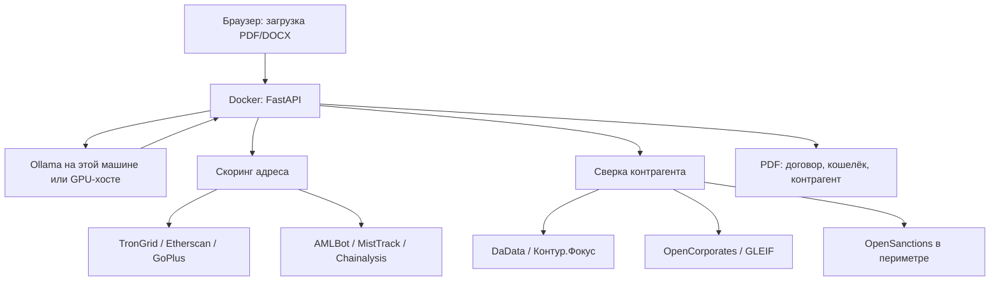

# Архитектура

[English version](ARCHITECTURE_EN.md)

Документ описывает, как сервис работает у юриста на своей машине.
Что готово — в разделе «Статус реализации».

---

## 1. Принципы

1. **Договор не уходит в публичный сервис генерации.** Файл загружается
   в браузере по адресу этой установки. Текст читает Ollama на этой машине
   или на арендованном GPU-хосте, которым управляет тот же пользователь.
   На GigaChat, облачные API и чужие модели он не отправляется.
2. **В интернет уходят только идентификаторы.** Номер кошелька — на публичные
   узлы и в коммерческий скоринг по ключу клиента. ИНН российской стороны —
   в DaData и Контур.Фокус. Наименование иностранного поставщика —
   в OpenCorporates и GLEIF. Санкционный скрининг по умолчанию идёт на свой
   сервер внутри периметра. Сам файл и полный текст договора в эти запросы
   не входят.
3. **Три блока в одном PDF.** Замечания по договору, скоринг кошелька,
   сверка контрагента. Это предварительный отчёт: его нельзя нести в банк
   как подтверждение соответствия.
4. **Файл не хранится.** Временный каталог, удаление сразу после PDF.
5. **Ссылка на норму — дословная.** «Ст. 1 ч. 7 п. 1» разрешается в текст
   из корпуса, а не пересказывается моделью.
6. **Вердикт не зависит от модели.** Цвет заключения ставят предикаты
   матрицы, модель разбирает только оговорки с нестандартной формулировкой.
   Всё, что она вернула, сверяется с текстом договора; не прошедшее
   выбрасывается. Класс модели определяет полноту одного раздела, и отчёт
   прямо называет модель, её класс и долю прочитанного текста.
7. **Договор длиннее одного окна читается окнами.** 24 000 знаков
   с перекрытием 1 500, не более шести окон. Непрочитанная часть названа
   в заключении: молчание по оговорке ничего не доказывает.

---

## 2. Поток



| Шаг | Что происходит | Где в коде |
|-----|----------------|------------|
| Приём файла | Браузер → `POST /check` / `/check/pdf`. Файл во временный каталог | `app/api/main.py`, `uploads.py` |
| Разбор | PDF/DOCX → текст и нумерованные пункты | `app/parsing` |
| Смысл оговорок | Локальная Ollama, JSON, окнами по 24 000 знаков; вердикт не ставит | `app/llm/clauses.py` |
| Класс модели | Оценка по имени либо балл приёмочного прогона | `app/llm/tiers.py` |
| Договор | Матрица из 32 правил | `app/rules` |
| Кошелёк | Из текста — адрес; вовне — возраст, активность, USDT, метки GoPlus и коммерческий скоринг по ключу клиента | `app/aml`, `app/aml/kyt.py` |
| Лица в договоре | Из текста и от модели — наименование, ИНН, роль и страна; российская сторона — DaData и Контур.Фокус (запасной вариант: ЕГРЮЛ / Rusprofile / СБИС); иностранная — OpenCorporates / GLEIF; обе — санкционный и PEP-скрининг | `app/counterparty` |
| Состояние источников | Включён, есть ли ключ, написан ли коннектор — считается один раз для всех блоков | `app/core/provider.py` |
| PDF | Три блока и оговорка о ручной перепроверке | `app/report/pdf.py` |

Оркестрация — FastAPI. LangGraph в прогоне не участвует и в зависимости
не входит.

---

## 3. Модель и железо

Модель отвечает за раздел «оговорки» и ни за что больше. Её ответ проходит
сверку с текстом договора: цитата обязана быть дословным фрагментом, сторона —
встречаться в тексте, адрес — совпадать с уже извлечённым. Поэтому модель
меньшего класса не портит вердикт, а снижает полноту одного раздела.

Опорная конфигурация, относительно которой написана документация:
`llama3.3:70b` в Ollama, квантование не грубее Q4. Видеокарта NVIDIA с 48 ГБ
(или две по 24 ГБ), 64 ГБ оперативной памяти, 100 ГБ на диске. Нет такой
карты — почасовая аренда GPU-хоста, `OLLAMA_BASE_URL` на этот хост. Docker
поднимает приложение; Ollama на Windows ставится отдельно — так проще отдать
видеокарту, чем через NVIDIA Container Toolkit внутри Compose.

Пригодность конкретной модели определяется прогоном, а не числом параметров:

```bash
python -m scripts.eval_llm --model <имя>
```

Семь показателей, порог 0.90, результат пишется в `data/eval/llm_gate.json`
и попадает в заключение вместо оценки по имени.

Без Ollama сервис работает: матрица отрабатывает полностью, раздел оговорок
остаётся пустым, и в заключении это сказано.

---

## 4. Матрица правил

Состав — [`RULES_SPEC.md`](RULES_SPEC.md), зеркало — `config/rules.yaml`.
Правила живут в git, а не в PostgreSQL: меняются вместе с кодом и покрыты
тестами.

Поле `effective_from` обязательно: 282-ФЗ вступает в силу поэтапно (ст. 56).
На 01.09.2026 отложены `ADR-005` (с 01.07.2027; предикат уже есть) и `RPT-003`
(репатриация пока не введена).

Правило нулевого уровня: договор должен быть внешнеторговым между резидентом
и нерезидентом (ст. 1 ч. 7 п. 1 № 282-ФЗ). Иначе расчёты под общим запретом
ч. 6 той же статьи.

---

## 5. Нормативный корпус

Ссылка правила ищется в `data/curated/norms.jsonl` без модели. Нет выверенного
текста — в отчёте «текст не выверен», не пересказ. Сборка: `scripts/build_norms.py`.
По пункту 2 статьи 7 № 115-ФЗ в корпус внесён консолидированный текст
(редакция от 10.06.2026; абзац шестнадцатый — в редакции 283-ФЗ). В корпус
внесены подп. 8–11 п. 1 ст. 6, п. 5.2-1, п. 5.2-2 и п. 16 ст. 7 № 115-ФЗ —
по тексту 283-ФЗ. Пункты 4.2, 4.3 и 5.1 Инструкции № 181-И внесены
по Указанию № 6819-У.

Поиск по формулировке (когда ссылки нет): BM25 с отсечением окончаний.
Эмбеддинги — по флагу `DENSE_SEARCH` / `--dense`.

---

## 6. Развёртывание

```
браузер  ──►  :8000  FastAPI (Docker)
                ├──►  Ollama (:11434 на хосте или OLLAMA_BASE_URL)
                ├──►  TronGrid / Etherscan / GoPlus — номер адреса
                ├──►  AMLBot / MistTrack / Chainalysis — номер адреса, по ключу
                ├──►  DaData / Контур.Фокус — ИНН российской стороны
                ├──►  OpenCorporates / GLEIF — имя иностранного поставщика
                └──►  yente (:8001, свой контейнер) — санкционный скрининг
```

`docker compose up --build` поднимает API. Ollama — отдельный процесс
на той же машине или на арендованном GPU-хосте. Страница доступна
по `127.0.0.1` и по IP машины в LAN.

---

## 7. Статус реализации

| Компонент | Статус |
|-----------|--------|
| Матрица правил, парсер PDF/DOCX, движок | Готово |
| Корпус норм, BM25, эмбеддинги по флагу | Готово |
| HTTP, страница, PDF из трёх блоков | Готово |
| Локальная Ollama на смысле оговорок | Вызывается окнами; если молчит — прогон идёт дальше |
| Покрытие текста моделью | Считается и печатается в заключении |
| Класс модели в заключении | По имени либо по баллу приёмочного прогона |
| Приёмочный прогон модели | `scripts/eval_llm.py`, режим записи и переигрывания |
| Факты по адресу в том же прогоне | Готово (TronGrid / Etherscan / GoPlus); не ст. 35 |
| Коммерческий скоринг адреса | Готово: AMLBot, MistTrack, Chainalysis по ключу клиента; подключены несколько — полосу ставит строжайший |
| Сверка стороны по ИНН | Готово: DaData даёт статус ЕГРЮЛ полем, Контур.Фокус — красные и жёлтые факты; без ключей публичные страницы как запасной вариант |
| Роль и страна лица из договора | Покупатель, поставщик, депозитарий, эмитент, банк; страна сужает санкционный скрининг |
| Сверка иностранного поставщика | Готово (OpenCorporates / GLEIF); нет ответа или нет однозначной записи — «сверка не выполнена» |
| Санкционный и PEP-скрининг | Готово: свой сервер OpenSanctions рядом с сервисом, `docker compose --profile sanctions up` |
| Источник без ключа или без коннектора | Отчёт называет причину поимённо; «проверено» из этого не получается |
| Docker Compose | API на 8000, Ollama на хосте через host.docker.internal |
| Дата проверки без `--on` / `?on=` | До 01.09.2026 — как на 01.09.2026, иначе сегодня |
| Повторный PDF по тому же файлу | Без второго вызова модели и реестров |

```bash
python -m scripts.check_contract договор.docx --on 2026-09-01 --pdf заключение.pdf
```
