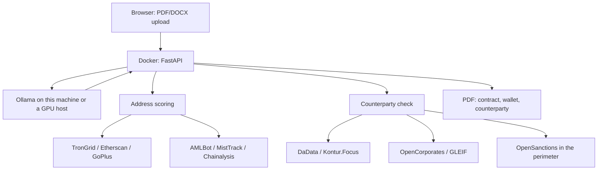

# Architecture

[Русская версия](ARCHITECTURE.md)

How the service runs on a lawyer's own machine. What is finished is listed under
"Implementation status".

---

## 1. Principles

1. **The contract never reaches a public generation service.** The file is
   uploaded in a browser at the address of this installation. The text is read
   by Ollama on this machine or on a rented GPU host controlled by the same
   user. It is not sent to GigaChat, to cloud APIs or to anyone else's model.
2. **Only identifiers leave for the internet.** The wallet address goes to
   public nodes and to the commercial screening service the client holds a key
   for, the Russian party's INN to DaData and Kontur.Focus, the foreign
   supplier's name to OpenCorporates and GLEIF. Sanctions screening runs by
   default against a server inside the perimeter. Neither the file nor the full
   contract text is part of those requests.
3. **Three blocks in one PDF.** Findings on the contract, wallet scoring,
   counterparty check. This is a preliminary report: it cannot be taken to a
   bank as proof of compliance.
4. **The file is not stored.** A temporary directory, deleted right after the
   PDF is produced.
5. **A statutory reference is verbatim.** "Art. 1 part 7 cl. 1" resolves to
   corpus text; it is never paraphrased by the model.
6. **The verdict does not depend on the model.** The colour of the report is set
   by matrix predicates; the model only reads clauses phrased in a non-standard
   way. Everything it returns is checked against the contract text and dropped
   if it does not match. The model tier governs the completeness of one section,
   and the report names the model, its tier and the share of text it read.
7. **A contract longer than one window is read in windows.** 24,000 characters
   with a 1,500-character overlap, at most six windows. Any unread part is named
   in the report: silence on a clause proves nothing.

---

## 2. Flow



| Step | What happens | Where in the code |
|------|--------------|-------------------|
| File intake | Browser → `POST /check` / `/check/pdf`, file to a temporary directory | `app/api/main.py`, `uploads.py` |
| Parsing | PDF/DOCX → text and numbered clauses | `app/parsing` |
| Clause meaning | Local Ollama, JSON, in 24,000-character windows; sets no verdict | `app/llm/clauses.py` |
| Model tier | Estimated from the name, or the acceptance-run score | `app/llm/tiers.py` |
| Contract | The 32-rule matrix | `app/rules` |
| Wallet | Address from the text; age, activity, USDT and GoPlus labels from outside, plus commercial screening on the client's key | `app/aml`, `app/aml/kyt.py` |
| Entities in the contract | Name, INN, role and country from the text and from the model; Russian party via DaData and Kontur.Focus (public pages as a fallback), foreign via OpenCorporates / GLEIF; both through sanctions and PEP screening | `app/counterparty` |
| Source state | Enabled, key present, connector written — computed once for every block | `app/core/provider.py` |
| PDF | Three blocks plus the manual-review notice | `app/report/pdf.py` |

Orchestration is plain FastAPI. LangGraph takes no part in a run and is not a
dependency.

---

## 3. Model and hardware

The model is responsible for the "clauses" section and for nothing else. Its
answer is checked against the contract text: a quote must be a verbatim
fragment, a party must occur in the text, an address must match one already
extracted. A smaller model therefore does not corrupt the verdict; it reduces
the completeness of one section.

The reference configuration the documentation is written against:
`llama3.3:70b` in Ollama, quantisation no coarser than Q4. An NVIDIA card with
48 GB (or two with 24 GB), 64 GB of RAM, 100 GB of disk. Without such a card,
rent a GPU host by the hour and point `OLLAMA_BASE_URL` at it. Docker runs the
application; on Windows Ollama is installed separately, which is a simpler way
to hand over the GPU than the NVIDIA Container Toolkit inside Compose.

Whether a given model is fit is settled by a run, not by a parameter count:

```bash
python -m scripts.eval_llm --model <name>
```

Seven metrics, a 0.90 threshold; the result is written to
`data/eval/llm_gate.json` and printed in the report instead of the name-based
estimate.

The service works without Ollama: the matrix runs in full, the clause section
stays empty, and the report says so.

---

## 4. Rule matrix

The contents are in [`RULES_SPEC_EN.md`](RULES_SPEC_EN.md); the mirror is
`config/rules.yaml`. Rules live in git rather than in PostgreSQL: they change
together with the code and are covered by tests.

The `effective_from` field is mandatory because 282-FZ takes effect in stages
(article 56). As at 01.09.2026 two rules are deferred: `ADR-005` (from
01.07.2027, predicate already written) and `RPT-003` (repatriation not yet
introduced).

The zero-level rule: the contract must be a cross-border trade contract between
a resident and a non-resident (art. 1 part 7 cl. 1 of 282-FZ). Otherwise the
settlement falls under the general prohibition of part 6 of the same article.

---

## 5. Normative corpus

A rule's reference is resolved in `data/curated/norms.jsonl` without any model.
Where no verified text exists, the report says "text not verified" rather than
paraphrasing. The corpus is built by `scripts/build_norms.py`.

For clause 2 of article 7 of 115-FZ the corpus holds the consolidated text
(as at 10.06.2026; the sixteenth paragraph as amended by 283-FZ). Subclauses
8–11 of clause 1 of article 6, clauses 5.2-1, 5.2-2 and 16 of article 7 of
115-FZ are entered per 283-FZ. Clauses 4.2, 4.3 and 5.1 of Instruction 181-I
are entered per Directive 6819-U.

Search by wording, when there is no reference: BM25 with suffix trimming.
Embeddings are enabled by the `DENSE_SEARCH` flag or `--dense`.

---

## 6. Deployment

```
browser  ──►  :8000  FastAPI (Docker)
                ├──►  Ollama (:11434 on the host, or OLLAMA_BASE_URL)
                ├──►  TronGrid / Etherscan / GoPlus — the address
                ├──►  AMLBot / MistTrack / Chainalysis — the address, on a key
                ├──►  DaData / Kontur.Focus — the Russian party's INN
                ├──►  OpenCorporates / GLEIF — the foreign supplier's name
                └──►  yente (:8001, own container) — sanctions screening
```

`docker compose up --build` starts the API. Ollama is a separate process on the
same machine or on a rented GPU host. The page is available on `127.0.0.1` and
on the machine's LAN address.

---

## 7. Implementation status

| Component | Status |
|-----------|--------|
| Rule matrix, PDF/DOCX parser, engine | Done |
| Norm corpus, BM25, embeddings behind a flag | Done |
| HTTP, page, three-block PDF | Done |
| Local Ollama on clause meaning | Called in windows; if silent, the run continues |
| Coverage of the text by the model | Computed and printed in the report |
| Model tier in the report | From the name, or from the acceptance-run score |
| Model acceptance run | `scripts/eval_llm.py`, with record and replay modes |
| On-chain facts in the same run | Done (TronGrid / Etherscan / GoPlus); not article 35 |
| Commercial address screening | Done: AMLBot, MistTrack, Chainalysis on the client's key; with several connected the strictest sets the band |
| Party check by INN | Done: DaData returns the EGRUL status as a field, Kontur.Focus adds red and yellow facts; without keys the public pages act as a fallback |
| Role and country of an entity from the contract | Buyer, supplier, depositary, issuer, bank; the country narrows sanctions screening |
| Foreign supplier check | Done (OpenCorporates / GLEIF); no answer or no unambiguous record means "check not performed" |
| Sanctions and PEP screening | Done: an OpenSanctions server next to the service, `docker compose --profile sanctions up` |
| Source without a key or a connector | The report names the reason; none of it turns into "checked" |
| Docker Compose | API on 8000, Ollama on the host via host.docker.internal |
| Check date without `--on` / `?on=` | Before 01.09.2026 treated as 01.09.2026, otherwise today |
| Repeated PDF for the same file | No second call to the model or the registries |

```bash
python -m scripts.check_contract contract.docx --on 2026-09-01 --pdf report.pdf
```
